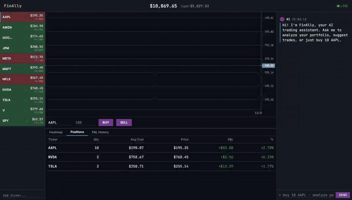
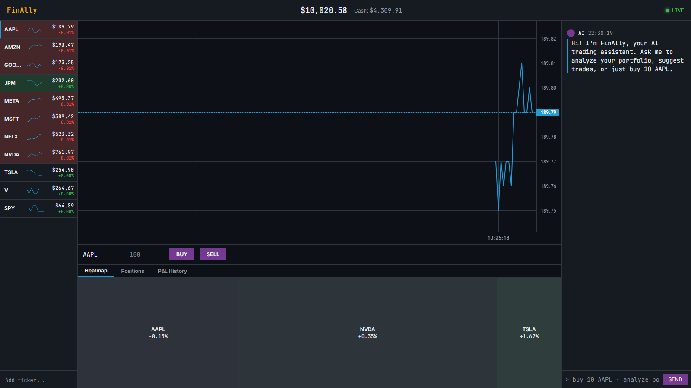
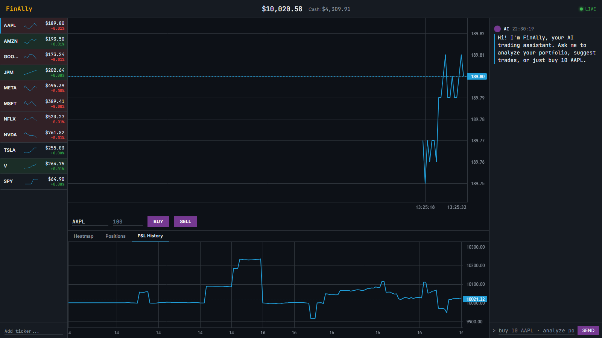
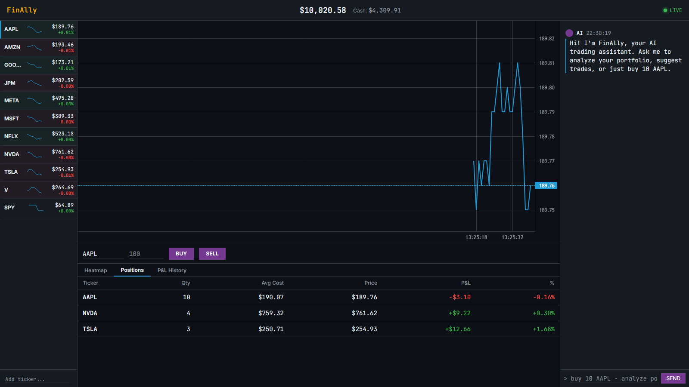

# FinAlly — AI Trading Workstation

A visually stunning AI-powered trading workstation that streams live market data, simulates portfolio trading, and integrates an LLM chat assistant that can analyze positions and execute trades via natural language.

Built entirely by coding agents as a capstone project for an agentic AI coding course.

<p align="center">
  
</p>


## Features

- **Live price streaming** via SSE with green/red flash animations
- **Simulated portfolio** — $10k virtual cash, market orders, instant fills
- **Portfolio visualizations** — heatmap (treemap), P&L chart, positions table
- **AI chat assistant** — analyzes holdings, suggests and auto-executes trades
- **Watchlist management** — track tickers manually or via AI
- **Dark terminal aesthetic** — Bloomberg-inspired, data-dense layout

## Architecture

Single Docker container serving everything on port 8000.

```
Browser
  │
  ├── GET /*           Static Next.js export (served by FastAPI)
  │
  ├── EventSource      GET /api/stream/prices  ──► Price cache (in-memory)
  │     └── Zustand priceStore                        ▲
  │           ├── WatchlistRow (flash animation)       │
  │           ├── SparklineChart (mini chart)          │ ~500ms tick
  │           └── MainChart (candlestick/line)         │
  │                                             GBM Simulator
  │                                             (or Massive API)
  ├── fetch            GET /api/portfolio       ──► SQLite
  │     └── Zustand portfolioStore              ──► PositionsTable
  │                                             ──► PortfolioHeatmap
  │                                             ──► PnLHistoryChart
  │
  └── fetch            POST /api/chat           ──► LiteLLM → OpenRouter
        └── ChatPanel                           ──► Auto-execute trades
                                                ──► Watchlist changes
```

- **Frontend**: Next.js static export (TypeScript + Tailwind) — no CORS, single origin
- **Backend**: FastAPI (Python/uv) — REST + SSE, serves static files
- **State**: Zustand stores (`priceStore`, `portfolioStore`, `watchlistStore`) — zero-boilerplate
- **Database**: SQLite (lazy init, Docker volume-mounted for persistence)
- **AI**: LiteLLM → OpenRouter with structured JSON output; `LLM_MOCK=true` for tests
- **Market data**: GBM simulator (default) or Massive API — same abstract interface

## Quick Start

```bash
# Clone and configure
cp .env.example .env
# Add your OPENROUTER_API_KEY to .env

# Run with Docker Compose
docker compose up --build

# Open http://localhost:8000
```

Or use Make:

```bash
make start   # build and run
make stop    # stop and remove container
make logs    # tail container logs
```

## API Documentation

API documentation is available at:
- **Swagger UI**: `http://localhost:8000/docs`
- **ReDoc**: `http://localhost:8000/redoc`

These endpoints are live while the backend is running and provide interactive API exploration.

## Environment Variables

| Variable | Required | Description |
|---|---|---|
| `OPENROUTER_API_KEY` | Yes | OpenRouter API key for AI chat |
| `MASSIVE_API_KEY` | No | Massive (Polygon.io) key for real market data; omit to use simulator |
| `LLM_MOCK` | No | Set `true` for deterministic mock LLM responses (testing) |

## Testing

**E2E tests** (Playwright, runs in Docker — no browser install needed):

```bash
make test            # default browser
make test-chromium   # Chromium only
make test-firefox    # Firefox only
```

Tests run with `LLM_MOCK=true` so no API key is required.

**Backend unit tests:**

```bash
cd backend
uv run pytest -v
```

CI runs backend tests + ruff linting + a docker build check on every push via GitHub Actions (`.github/workflows/test.yml`).

## Troubleshooting

### Port 8000 already in use

```bash
# Find and kill the process using port 8000
lsof -ti:8000 | xargs kill -9          # macOS/Linux
netstat -ano | findstr :8000            # Windows (note the PID, then:)
taskkill /PID <pid> /F                  # Windows
```

### Database resets on every restart

The SQLite file is stored in a Docker named volume. If you're using `docker run` directly (not `make`), make sure to include the volume flag:

```bash
docker run -v finally-data:/app/db -p 8000:8000 --env-file .env finally
```

If you used `docker compose up`, the volume is managed automatically. Check with:

```bash
docker volume ls | grep finally
```

### Prices not streaming / connection indicator red

The SSE stream reconnects automatically, but if it stays red:

1. Check the container is running: `docker ps`
2. Check backend logs: `make logs` (or `docker logs finally`)
3. Verify you're opening `http://localhost:8000` — not a different port

### AI chat returns errors

- Confirm `OPENROUTER_API_KEY` is set in your `.env` file
- The key must have credits on [openrouter.ai](https://openrouter.ai)
- For local testing without an API key, set `LLM_MOCK=true` in `.env`

### Windows — no `make` command

The `Makefile` shortcuts require `make`, which isn't installed by default on Windows. Use the PowerShell scripts instead:

```powershell
.\scripts\start_windows.ps1   # build and run
.\scripts\stop_windows.ps1    # stop and remove container
docker logs finally            # tail logs
```

Or run the Docker commands directly:

```powershell
docker compose up --build -d
docker compose down
docker compose logs -f
```

## Project Structure

```
finally/
├── frontend/               # Next.js (TypeScript) static export
│   └── src/
│       ├── components/     # UI components (watchlist, chart, heatmap, chat)
│       ├── store/          # Zustand state management
│       └── lib/            # API client, SSE hook, utilities
├── backend/                # FastAPI uv project (Python)
│   └── app/
│       ├── chat/           # LLM integration (LiteLLM → OpenRouter)
│       ├── market/         # Price simulator + Massive API + SSE stream
│       ├── portfolio/      # Trade execution, P&L, snapshots
│       └── watchlist/      # Ticker management
├── test/                   # Playwright E2E tests
│   ├── specs/              # Test specs (fresh-start, trading, chat, watchlist)
│   └── docker-compose.test.yml
├── docs/screenshots/       # README screenshots and demo GIF
├── db/                     # SQLite volume mount (runtime, gitignored)
├── Makefile                # start / stop / test shortcuts
├── docker-compose.yml
└── Dockerfile              # Multi-stage: Node 20 build → Python 3.12 serve
```

## Screenshots

<p align="center">
  
  
  
</p>

## License

See [LICENSE](LICENSE).
