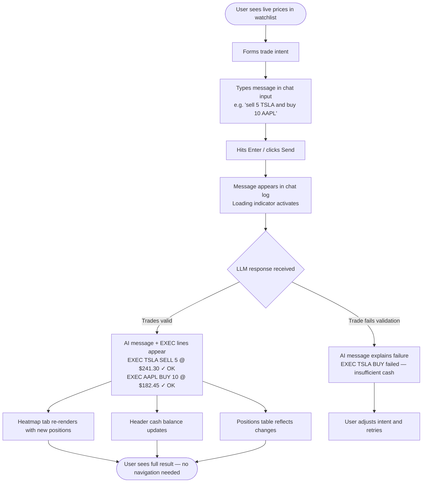
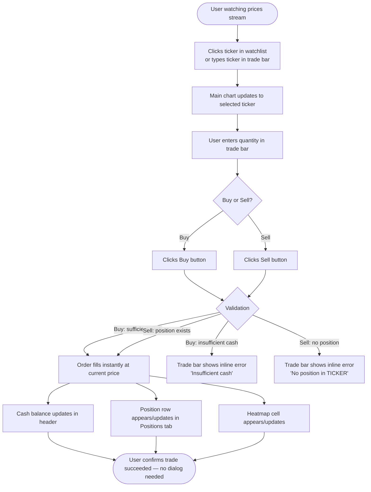
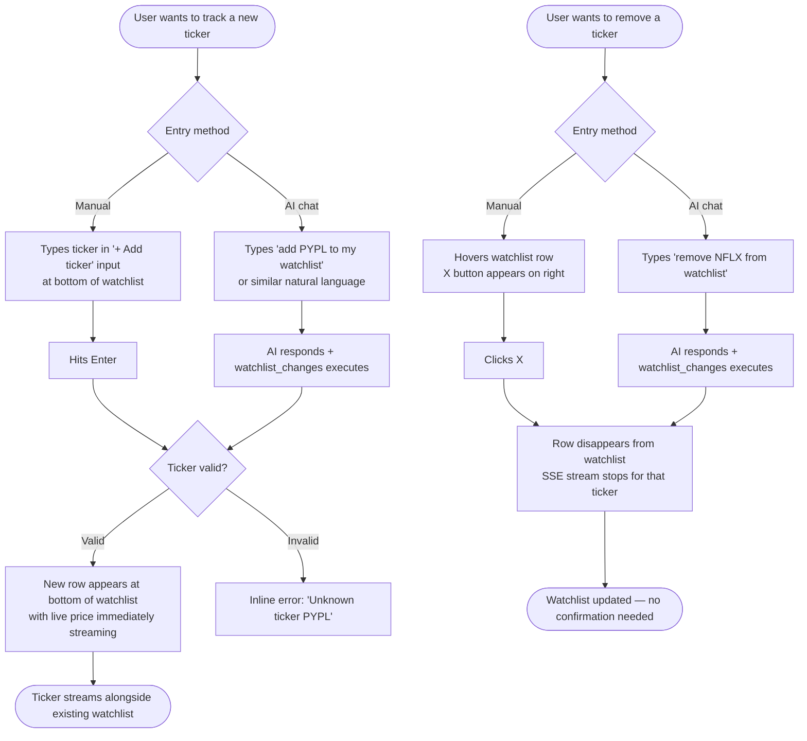
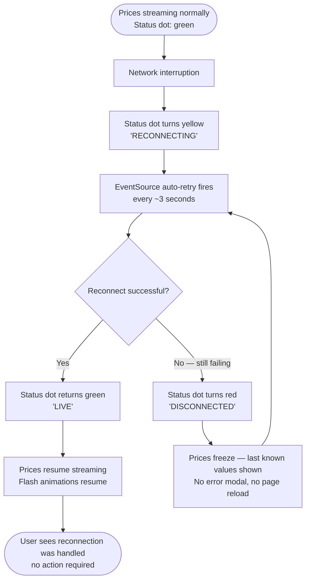

# UX Design Specification FinAlly

**Author:** Jim
**Date:** 2026-04-11

---

<!-- UX design content will be appended sequentially through collaborative workflow steps -->

## Executive Summary

### Project Vision

FinAlly (Finance Ally) is a visually stunning AI-powered trading workstation — a Bloomberg terminal with an AI copilot built in. Users watch live prices stream, manage a simulated $10,000 portfolio, and interact with an LLM assistant that can analyze positions and execute trades on their behalf through natural language. It is the capstone project of an agentic AI coding course, demonstrating what orchestrated AI agents can produce.

### Target Users

**Primary context:** Students of the agentic AI coding course, experiencing a production-quality AI-built application firsthand.

**In-product persona:** A retail investor or trading enthusiast who is comfortable with financial UIs, expects real-time data, and wants an intelligent assistant for portfolio management. Desktop-first. Accustomed to dense, information-rich interfaces. Values speed and directness over hand-holding.

### Key Design Challenges

1. **Information density vs. readability** — A Bloomberg-style layout packs a lot on screen; every panel competes for attention. The challenge is making it feel professional and dense without being overwhelming or confusing.
2. **Real-time update clarity** — Prices update at ~500ms intervals continuously. Flash animations must inform without fatiguing; sparklines grow progressively. Getting the visual rhythm right is critical to a polished feel.
3. **AI action transparency** — When the AI auto-executes a trade or modifies the watchlist, the user must see and trust what happened. The boundary between human action and AI action must be visually distinct and confirmatory without requiring confirmation dialogs.

### Design Opportunities

1. **Fluid AI-to-trade UX** — The chat → auto-execute → portfolio-updates flow is the showstopper feature. Making this feel seamless and immediately visible elevates the entire product and demonstrates agentic AI capabilities compellingly.
2. **Terminal aesthetic done right** — Most "terminal-inspired" UIs look amateurish. Executing it with precision — tight grid, sharp typography, disciplined use of accent colors — is a strong differentiator.
3. **Progressive engagement** — The default state (10 tickers, $10k cash, no setup) delivers immediate value. The watchlist and AI chat naturally draw users deeper without onboarding friction.

## Core User Experience

### Defining Experience

The core loop of FinAlly is: **See price → form intent → execute trade → see portfolio update.** Whether the trade comes from the manual trade bar or the AI chat, this loop must feel instant and trustworthy. The AI chat version — type intent → AI executes → portfolio updates — is the showstopper demo moment the entire experience supports.

### Platform Strategy

Web-only, desktop-first application. Mouse and keyboard primary interface. Wide-screen layouts optimized for data density. Always-online (SSE stream requires continuous connection). No offline mode. Single-page application — all state lives in the current view with no page transitions.

### Effortless Interactions

- Price streaming and flash animations — ambient, zero user action required
- One-click ticker selection to focus the main chart
- Natural language trade commands processed and executed by the AI without friction
- Portfolio reflecting trade results immediately — no refresh or manual update needed

### Critical Success Moments

1. **First AI trade execution** — User types a chat command, the AI responds, and the portfolio updates on screen. This is the "wow" moment.
2. **Price flash rhythm** — Within seconds of page load, green/red flashes establish the sense of a live, breathing market.
3. **Heatmap after a win** — A position turning green in the treemap gives tangible, visual feedback that decisions have consequences.
4. **SSE reconnection** — Smooth automatic reconnect with the status dot returning to green builds system confidence.

### Experience Principles

1. **Speed is trust** — Every interaction must feel instant. Latency destroys confidence in a trading context. The only acceptable loading state is the AI chat response.
2. **Show, don't ask** — No confirmation dialogs. Market orders fill immediately. AI trades auto-execute. Results appear in the UI. Simulated money means zero friction is appropriate.
3. **Ambient data, foregrounded action** — Streaming prices are background context; trade execution and AI chat are foreground. Layout and visual hierarchy enforce this distinction.
4. **AI actions are visible and attributed** — Every AI-executed trade or watchlist change must be explicitly confirmed in the chat thread. Users should never wonder if an action occurred.

## Desired Emotional Response

### Primary Emotional Goals

The primary emotional target is: **"I feel like a professional trader with a superpower."** The AI augments the user's judgment rather than replacing it. Supporting emotions are confidence (the data is live, the system works), delight (the AI executed my intent, the heatmap responded), and control (everything is visible and reversible).

Emotions to actively avoid: anxiety about whether actions completed, confusion about what the AI did, and overwhelm from unstructured data density.

### Emotional Journey Mapping

| Stage | Target Emotion |
|---|---|
| First page load | **Impressed** — professional, data-rich, immediately alive |
| First price flash | **Engaged** — confirms the system is real-time |
| First manual trade | **Capable** — instant fill, immediate portfolio update |
| First AI trade | **Amazed** — the AI executed my intent without friction |
| Watching the heatmap | **Invested** — these positions feel owned and meaningful |
| AI explains a position | **Trusted** — it knows my portfolio and works for me |
| Connection interruption | **Reassured** — automatic reconnect, system is resilient |

### Micro-Emotions

- **Confidence over confusion** — every UI element communicates its purpose at a glance
- **Trust over skepticism** — AI actions are explicitly attributed with concrete details
- **Excitement over anxiety** — animations are informational and celebratory, not alarming
- **Accomplishment over frustration** — instant trade fills and immediate portfolio reflection provide positive reinforcement

### Design Implications

- **Impressed on first load** → Layout renders with live prices already streaming; no empty states, no onboarding
- **Amazed at AI trade** → Chat shows trade confirmation inline: ticker, quantity, price, status — specific and irrefutable
- **Control** → Positions table always visible; AI actions are reversible; connection status dot always in header
- **Trusted** → AI responses are concise and data-referenced, not generic; always cites actual portfolio numbers

### Emotional Design Principles

1. **Augment, don't replace** — design choices should make users feel smarter and faster, not dependent or passive
2. **Concrete over abstract** — emotional trust comes from specific numbers and visible confirmations, never vague status messages
3. **Celebrate the moment** — the first AI trade execution is a showstopper; the UI should make it unmistakably visible
4. **Resilience is reassurance** — error states and reconnections must feel handled, not alarming

## UX Pattern Analysis & Inspiration

### Inspiring Products Analysis

**Bloomberg Terminal** — The explicit aesthetic inspiration. Key lessons: information density with disciplined grid layout; color used sparingly but precisely; "nothing is decorative" philosophy; every element earns its place.

**TradingView** — The modern web-native trading UI benchmark. Key lessons: clean dark theme that feels premium; watchlist + chart + panel layout pattern; live prices with mini-charts beside each ticker; one-click ticker selection updating the main chart instantly.

**Linear** — Gold standard for fast, dense, dark web UIs. Key lessons: speed as a product feature (no unnecessary spinners); monospace numbers prevent layout shift; AI features integrated inline without interrupting workflow.

### Transferable UX Patterns

**Layout:**
- Three-panel layout: Watchlist (left) | Chart (center) | Portfolio/Chat (right)
- Fixed header showing global state: total value, cash balance, connection status

**Interaction:**
- One-click ticker context switch — no navigation, no modal
- Inline AI action confirmation — trade results visible immediately in chat thread
- Ambient price flash animation — the only motion in the UI; nothing else animates unless data changes

**Visual:**
- Monospace font for all prices and numbers (prevents layout shift on live updates)
- Color = meaning, always: green/red for P&L only, yellow for interactive elements, blue for primary information
- Muted dark backgrounds (`#0d1117`) with high-contrast foreground data elements

### Anti-Patterns to Avoid

- **Modal trade confirmations** — destroys instant-fill feel; no confirmation dialogs
- **Toast notifications for AI actions** — ephemeral and missable; AI confirmations must be permanent in chat thread
- **Chat panel hidden by default** — must be visible on first load to showcase the AI capability
- **Lazy chart loading** — chart renders immediately on ticker selection, no skeleton delay
- **Uncustomized dark theme** — accent colors (`#ecad0a`, `#209dd7`, `#753991`) must be applied with precision, not left to library defaults

### Design Inspiration Strategy

**Adopt:**
- TradingView three-panel layout structure
- Linear's "speed is the feature" interaction philosophy
- Bloomberg's monospace-for-numbers visual pattern

**Adapt:**
- TradingView's sparkline-beside-ticker pattern → add to our watchlist rows
- Linear's inline AI confirmation → applied to trade execution results in chat

**Avoid:**
- Bloomberg's steep learning curve — our layout should be immediately readable
- TradingView's feature overwhelm — we show only what serves the core loop

## Visual Design Foundation

### Color System

**Surface layer** (structure and depth):
- Page background: `#0d1117`
- Panel/card surface: `#161b22`
- Borders and dividers: `#30363d`

**Text layer** (readable content):
- Primary text: `#e6edf3`
- Muted/secondary text: `#8b949e`

**Semantic layer** (data meaning):
- Price uptick / positive P&L: `#3fb950`
- Price downtick / negative P&L: `#f85149`

**Brand layer** (identity and interaction):
- Accent yellow (highlights, interactive): `#ecad0a`
- Blue primary (information, links): `#209dd7`
- Purple action (submit buttons): `#753991`

### Typography System

| Role | Font | Size | Weight |
|---|---|---|---|
| Prices and financial values | JetBrains Mono | 13–16px | 500 |
| Ticker symbols | JetBrains Mono | 12–14px | 600 |
| Header portfolio value | JetBrains Mono | 18–20px | 600 |
| UI labels and column headers | Inter / system-ui | 11–12px | 400–600 |
| Body text and chat messages | Inter / system-ui | 13–14px | 400 |
| Panel section titles | Inter / system-ui | 11px uppercase | 600 |

Monospace font for all numerical values prevents layout shift during live price updates (numbers have variable widths in proportional fonts).

### Spacing & Layout Foundation

- **Base unit:** 4px
- **Panel interior padding:** 12–16px
- **Data row height:** 36–40px (dense but tap-safe)
- **Borders:** 1px only — no drop shadows, no gradients
- **Layout system:** CSS Grid for three-panel structure; Flexbox within panels

**Three-panel proportions:**
- Watchlist: ~22% width
- Main chart + portfolio area: ~50% width
- AI chat panel: ~28% width
- Header: fixed 48px height

### Accessibility Considerations

- All primary text meets WCAG AAA contrast on dark backgrounds (~13:1)
- Muted text meets WCAG AA (~5.5:1)
- Price flash animations use both color and timing — visible in grayscale
- P&L values always include `+/-` prefix — information never conveyed by color alone
- Focus rings use `accent-yellow` for keyboard navigation visibility

## Defining Core Experience

### 2.1 Defining Experience

FinAlly's defining interaction is: **Chat → Execute → See it.** The user types a natural language intent, the AI responds with analysis and executes the trade, and the portfolio updates immediately on screen. This is the showstopper moment — everything else in the UI is the stage that makes this sequence possible.

### 2.2 User Mental Model

Users arrive with either a command-driven model (know what they want, type it) or a dashboard-driven model (scan all data, then decide). The chat panel serves both: command users type directly; dashboard users use the ambient data to form intent before engaging the AI. The AI bridges the gap — it can interpret vague intents ("I'm too heavy in tech") and translate them into concrete executable actions.

User expectations to meet:
- AI understands tickers, quantities, and directional intent without rigid syntax
- Portfolio updates immediately after execution — no refresh required
- Failures (insufficient cash) explained with exact numbers, not vague errors

### 2.3 Success Criteria

- Chat response appears in under 3 seconds
- Trade confirmation shows: ticker, side, quantity, execution price, and status
- Portfolio values (heatmap, table, header) update within 1 second of confirmation
- Every AI action is attributable — user can see exactly what changed and why
- Failure cases explain the gap precisely: "You need $X more to buy Y shares at $Z"

### 2.4 Novel vs. Established Patterns

| Aspect | Pattern | Notes |
|---|---|---|
| Chat interface | Established | No education needed — universal mental model |
| AI parsing financial intent | Novel | Trust built through immediate visible confirmation |
| Auto-execution without dialog | Novel | Deliberate convention break — works because money is simulated |
| Portfolio updating post-AI-trade | Established | Same behavior as manual trades — familiar |

The novel elements are self-teaching: the first successful AI trade is the tutorial.

### 2.5 Experience Mechanics

**Initiation:** Chat panel is open and ready on first load — no "new chat" button. Placeholder text hints at capability: *"Ask about your portfolio or say 'buy 10 AAPL'..."*

**Interaction:** User types → hits Enter → message appears in thread → loading indicator activates.

**Feedback:** AI response appears with:
- Conversational analysis text
- Inline trade badge(s): `TSLA SELL 5 @ $241.30 ✓` or `JPM BUY failed — insufficient cash`

**Completion:** Portfolio heatmap re-renders, positions table and header cash balance update. All changes visible without navigation.

## Design System Foundation

### Design System Choice

**Tailwind CSS with selective shadcn/ui primitives** — a themeable, utility-first approach with full custom design token control. No heavy component library runtime. Charting handled by Lightweight Charts (TradingView library) for the main chart and sparklines; custom implementation for the portfolio treemap heatmap.

### Rationale for Selection

- **Visual precision required** — trading terminal aesthetic demands exact control over colors, spacing, and typography; pre-built component libraries impose too many visual opinions
- **AI codegen alignment** — Tailwind's utility-first approach is well-suited to AI-generated code: explicit, composable, no hidden magic
- **Performance** — zero runtime CSS overhead; unused styles purged at build time
- **No lock-in** — shadcn/ui components are copied into the project as source code, not imported as a dependency — fully customizable

### Design Tokens

| Token | Value | Usage |
|---|---|---|
| `background` | `#0d1117` | Page and panel backgrounds |
| `surface` | `#161b22` | Cards, panels, elevated surfaces |
| `border` | `#30363d` | All borders and dividers |
| `text-primary` | `#e6edf3` | Primary readable text |
| `text-muted` | `#8b949e` | Labels, secondary info |
| `accent-yellow` | `#ecad0a` | Interactive elements, highlights |
| `blue-primary` | `#209dd7` | Primary information, links |
| `purple-action` | `#753991` | Submit/action buttons |
| `green-up` | `#3fb950` | Price upticks, positive P&L |
| `red-down` | `#f85149` | Price downticks, negative P&L |
| Numbers/prices | JetBrains Mono (monospace) | All financial values |
| Labels/text | Inter / system-ui | All UI text |

### Implementation Approach

1. Configure Tailwind `tailwind.config.ts` with the custom design tokens above as the full color palette
2. Use shadcn/ui for form primitives (inputs, buttons) — gives accessible, keyboard-navigable components without visual opinions
3. Integrate Lightweight Charts for the main ticker chart — placed in a dedicated React component with full dark theme configuration
4. Build the watchlist sparklines using the same Lightweight Charts library in minimal mode
5. Implement the portfolio treemap as a custom component using sized `div` elements or a lightweight canvas renderer

### Customization Strategy

All color values defined as CSS custom properties via Tailwind config — single source of truth. Component variants (e.g., buy button vs. sell button) expressed as Tailwind class combinations, not separate components. Dark mode is the only mode — no light/dark toggle needed.

## Design Direction Decision

### Design Directions Explored

Six directions were generated and evaluated, ranging from a minimal single-column layout to a Bloomberg-dense four-panel grid. The full interactive HTML showcase is at `_bmad-output/planning-artifacts/ux-design-directions.html`. Three directions were shortlisted: Dir 01 (Command Dashboard), Dir 03 (AI Command Center), and Dir 05 (Data-Dense Terminal).

### Chosen Direction

**Dir 03 — AI Command Center** with the following refinements:

- **Panel layout:** 180px watchlist | flex-1 center | 300px AI chat (fixed right)
- **Chat treatment:** C Hybrid — standard `#161b22` surface, flat terminal log rows, avatar circle anchoring each AI block on the label row (`🤖 AI · 14:32:07`), EXEC log lines for trade confirmations, terminal input (`>` prefix + flat underline field + rectangular purple "Send" button)
- **Data panels:** Option 1 — Tabs below the main chart (Heatmap · Positions · P&L History), giving the chart maximum vertical space
- **Watchlist rows:** Ticker symbol | sparkline mini-chart | stacked price + % change — all three data points visible in 180px with no horizontal crowding

### Design Rationale

Dir 03 keeps the AI chat panel permanently visible without sacrificing data density — the defining requirement for demonstrating the agentic AI capability. The C Hybrid chat treatment avoids "chatbot widget" aesthetics (no purple-tinted background, no rounded bubbles) while retaining clear AI attribution through the avatar-anchored label row. The terminal input (`>` prompt) reinforces the Bloomberg-terminal aesthetic throughout. The tabbed data panel layout gives the main chart the majority of vertical space — charts communicate at a glance, tables require deliberate focus — and tabs are one click away with zero crowding. Watchlist sparklines surface price trend without requiring the user to look at the main chart for each ticker, adding significant at-a-glance value in a small footprint.

### Implementation Approach

- CSS Grid three-column layout; chart section `flex: 1` grows to dominate vertical space; tab strip is a fixed 30px shelf
- Lightweight Charts in minimal mode for watchlist sparklines (same library as the main chart, no additional dependency)
- Chat log rendered as a flat `div` list (no chat bubble components); avatar dot is an 18px purple circle injected on the AI label row only
- Terminal input styled with `border-bottom` underline only, transparent background, monospace font — no border radius anywhere in the input area

## User Journey Flows

### Journey 1: AI Trade Execution (Showstopper)

The defining journey — user types natural language intent, AI executes, portfolio updates without leaving the screen.



**Key design decisions:**
- Chat log is permanent — EXEC lines never disappear, fully auditable
- All three portfolio views update simultaneously, no refresh
- Failure message includes exact numbers ("You need $X more") not vague errors
- Loading indicator is the only acceptable latency — all else is instant

---

### Journey 2: Manual Trade Execution

Direct trade entry via the trade bar — for users who know exactly what they want.



**Key design decisions:**
- No confirmation dialog — simulated money, zero friction is appropriate
- Errors are inline in the trade bar, not toasts (toasts are ephemeral and missable)
- Ticker selection and trade are linked — clicking a watchlist row pre-fills the trade bar ticker field

---

### Journey 3: Watchlist Management

Adding and removing tickers — both manual and via AI chat command.



---

### Journey 4: SSE Reconnection (Resilience)

Connection drops are inevitable — the user experience during recovery matters.



**Key design decisions:**
- Status dot is always visible in the header — the only reconnection UI needed
- No error modal, no page reload, no user action required
- Frozen prices (last known values) shown during disconnection — never blank

---

### Journey Patterns

**Instant feedback pattern** — every action (trade, watchlist add, chat send) produces visible result within 1 second. No spinner, no skeleton, no "processing" state except the AI chat loading indicator.

**Inline error pattern** — errors appear adjacent to the action that caused them (trade bar errors in the trade bar, AI failures in the chat log). Never toasts, never modals.

**Ambient update pattern** — portfolio values in the header, heatmap colors, and sparkline shapes update as a background consequence of actions; users notice change without being directed to it.

**AI attribution pattern** — every AI action is explicitly logged with ticker, side, quantity, price, and status. Users can scroll back and see the full action history.

### Flow Optimization Principles

1. **Zero-step confirmation** — no action in FinAlly requires a confirmation dialog; trust is built through immediate visible results, not gates
2. **Parallel portfolio update** — all portfolio views (header, heatmap, positions table) update simultaneously after any trade; users never see stale data in one panel
3. **Forgiving watchlist** — adding an invalid ticker fails gracefully inline; removing a ticker with an open position is allowed (position persists, ticker leaves watchlist)
4. **Persistent chat history** — the full chat log including EXEC confirmations persists for the session; users can scroll back to see exactly what the AI did and when

## Component Strategy

### Design System Components

**Tailwind CSS** provides all layout, spacing, color tokens, and typography utilities — no runtime overhead. **shadcn/ui** contributes accessible form primitives:

- `Button` — Buy, Sell, Send buttons (customized with `purple-action` token)
- `Input` — ticker field, quantity field, add-ticker input (flat border-bottom variant)
- `ScrollArea` — chat log overflow, positions table scroll

These are copied as source into the project (shadcn pattern) and overridden to match the design tokens exactly.

### Custom Components

#### WatchlistRow
**Purpose:** Displays one ticker with live price, trend sparkline, and % change.
**Anatomy:** `[symbol 30px] [SparklineChart 52×20px] [price + % stacked right]`
**States:** default, active (blue left border + highlight), flash-green, flash-red
**Interaction:** click selects ticker → main chart updates + trade bar pre-fills
**Accessibility:** `role="row"`, `aria-selected` on active row

#### PriceFlash
**Purpose:** Brief background color pulse on price change — the ambient "live market" signal.
**Behavior:** On new SSE price: apply `.flash-green` or `.flash-red` CSS class for 500ms then remove.
**Implementation:** CSS `@keyframes` fade from colored background to transparent; triggered by React `useEffect` comparing previous vs current price.
**States:** idle, flash-up (green), flash-down (red)

#### MainChart
**Purpose:** Full-width candlestick/line chart for the selected ticker.
**Implementation:** Lightweight Charts `createChart()` in a `useEffect`; ResizeObserver keeps it responsive; dark theme configured via `chart.applyOptions()`.
**States:** loading (skeleton line), displaying data, ticker-switching (instant re-render)

#### SparklineChart
**Purpose:** 52×20px mini price-line per watchlist row, built from SSE data accumulated since page load.
**Implementation:** Lightweight Charts in minimal mode (no axes, no grid, no crosshair); same library instance as MainChart, zero additional dependency.
**Data:** frontend accumulates `{time, value}` array per ticker from SSE stream; sparkline updates on each new price event.

#### PortfolioHeatmap
**Purpose:** Treemap visualization — positions sized by portfolio weight, colored by P&L %.
**Implementation:** Custom `div`-based layout using CSS `flex-wrap` with `flex-basis` sized proportional to position weight; background color interpolated between `red-down` and `green-up` based on P&L %.
**States:** empty (no positions — shows placeholder message), populated, post-trade-update (cells resize/recolor)
**Accessibility:** each cell has `aria-label="AAPL +8.5%"`

#### ChatLog
**Purpose:** Flat terminal-style log of the conversation with inline AI attribution and EXEC confirmations.
**Variants:**
- `.log-user` — `> ` prefix, accent-yellow text
- `.log-ai-label` — avatar dot + "AI" label + timestamp on one row
- `.log-ai` — indented text with blue left border
- `.log-exec-ok` — green EXEC confirmation line
- `.log-exec-fail` — red EXEC failure line
**States:** idle, loading (animated `...` cursor after last AI label)

#### TradeBar
**Purpose:** Quick manual trade entry — ticker, quantity, buy/sell.
**Anatomy:** `[Ticker input] [Qty input] [Buy button] [Sell button] [inline error]`
**States:** idle, ticker-prefilled (from watchlist click), submitting (buttons disabled), error (inline message below inputs)
**Interaction:** clicking a WatchlistRow pre-fills the ticker field via shared state

#### TabStrip
**Purpose:** Switch between Heatmap, Positions, and P&L History panels below the main chart.
**Implementation:** simple controlled component — `activeTab` state, three tab buttons, renders active panel.
**States:** one of three tabs active; tab bar is 30px fixed height; active tab has blue bottom border

#### StatusDot
**Purpose:** Always-visible connection health indicator in the header.
**States:** `connected` (green, subtle glow), `reconnecting` (yellow, pulsing animation), `disconnected` (red, no animation)
**Implementation:** driven by EventSource `onopen`/`onerror` events

#### PositionsTable
**Purpose:** Tabular view of all holdings with live-updating current price and P&L.
**Columns:** Ticker · Qty · Avg Cost · Price (live) · Unrealized P&L · %
**Implementation:** all numeric cells use `font-family: JetBrains Mono` to prevent layout shift on live updates; P&L and % cells re-render green/red on each price tick.

### Component Implementation Strategy

- All custom components use Tailwind utility classes only — no inline styles in production code
- Design tokens (`bg-surface`, `text-accent`, etc.) applied via Tailwind config aliases
- Live-updating cells (price, P&L) use React state driven by a shared SSE context/hook
- Lightweight Charts instances managed in `useEffect` with cleanup on unmount — one chart instance per component

### Implementation Roadmap

**Phase 1 — Core shell (layout renders, prices stream):**
- StatusDot, WatchlistRow + PriceFlash, MainChart, SparklineChart, TabStrip

**Phase 2 — Portfolio and trading:**
- PortfolioHeatmap, PositionsTable, TradeBar

**Phase 3 — AI chat:**
- ChatLog (all variants including EXEC lines and loading state)

## UX Consistency Patterns

### Button Hierarchy

**Primary action (trade execution):** Purple background (`#753991`), uppercase, no border radius. Used for: Buy, Sell, Send. Never more than two primary buttons visible simultaneously.

**Secondary action (watchlist add, tab selection):** No background, border or underline only, muted text that activates to primary on hover. Used for: tab buttons, "+" add ticker.

**Destructive action (remove ticker):** Red text on hover only — revealed by hover on the row, not permanently visible. No confirmation dialog.

**Disabled state:** 40% opacity, `cursor: not-allowed`. Applied during trade submission only (buttons re-enable immediately after response).

**Rule:** No icon-only buttons. Every button has a visible text label.

---

### Feedback Patterns

FinAlly deliberately avoids toasts and modals. All feedback is contextual and permanent within its panel.

| Situation | Feedback mechanism |
|---|---|
| Trade executed (manual) | Portfolio panels update immediately — result is self-evident |
| Trade executed (AI) | EXEC log line in chat: `EXEC AAPL BUY 10 @ $182.45 ✓ OK` |
| Trade failed (manual) | Inline error below trade bar inputs, red text |
| Trade failed (AI) | EXEC log line in chat: `EXEC AAPL BUY failed — insufficient cash` |
| Watchlist add success | New row appears in watchlist with live price |
| Watchlist add failure | Inline error below add-ticker input |
| SSE connected | Status dot green, `LIVE` label |
| SSE reconnecting | Status dot yellow, `RECONNECTING` label, pulsing animation |
| SSE disconnected | Status dot red, `DISCONNECTED` label, prices frozen |
| AI thinking | Loading indicator in chat (animated `...` after AI label row) |

**Rule:** No toast notifications anywhere in the application. Feedback is either permanent (chat log, error text) or ambient (portfolio panel updates, status dot).

---

### Form Patterns

All inputs use the flat border-bottom style — no full border boxes, no rounded corners, no background fill:

```css
border: none;
border-bottom: 1px solid var(--border);
background: transparent;
font-family: JetBrains Mono;
```

**Validation:** Client-side only, on submit. No live validation while typing (distracting in a trading context). Error message appears inline below the field in red, disappears on next successful submit.

**Placeholder text:** Muted (`#30363d` — same as border) so it doesn't compete with actual data. Descriptive but brief: `"AAPL"`, `"10"`, `"buy 10 AAPL · analyze portfolio"`.

**Focus state:** Border-bottom changes from `var(--border)` to `var(--blue)`. No glow, no shadow — just the line color change.

**Keyboard:** Enter submits in all single-field contexts (add ticker, chat input). Tab moves between trade bar fields in logical order (ticker → qty → Buy/Sell).

---

### Navigation Patterns

FinAlly is a single-page application with no routing. All navigation is in-panel state changes:

**Ticker selection:** Clicking a WatchlistRow updates `selectedTicker` state → MainChart re-renders → TradeBar ticker field pre-fills. No page transition. Active row gets blue left border.

**Tab navigation:** Clicking a TabStrip tab updates `activeTab` state → panel content swaps instantly. No animation, no transition — instant swap matches terminal feel.

**No back button dependency:** The app has no navigation history. Browser back button has no meaningful effect. This is acceptable for a desktop trading tool.

---

### Empty States

| Panel | Empty state |
|---|---|
| Positions tab | `"No positions — buy something to get started"` centered, muted text |
| Heatmap tab | Same message, centered in the heatmap area |
| P&L History tab | `"No history yet — portfolio snapshots appear after your first trade"` |
| Chat log | Single AI greeting message pre-populated on load: system prompt primer |

**Rule:** Empty states use muted secondary text only — no illustrations, no large icons. The terminal aesthetic demands text-first communication.

---

### Loading States

The only acceptable loading state is the AI chat response indicator. All other interactions must feel instant:

**AI loading:** After user sends message, a `.log-ai-label` row appears with the avatar dot and an animated `...` cursor. This is the only spinner/loader in the entire application.

**Price data:** On first load, the SSE stream begins immediately. Watchlist rows render with `—` placeholder prices for any ticker not yet received, replacing with live data within ~500ms. No skeleton screens.

**Chart switching:** MainChart re-renders synchronously when a ticker is selected — Lightweight Charts redraws from the in-memory price cache. No loading state.

---

### Color Usage Rules

These rules are absolute — no exceptions:

- **Green (`#3fb950`):** Price uptick flash, positive P&L, positive % change, EXEC OK lines, status dot connected. Never decorative.
- **Red (`#f85149`):** Price downtick flash, negative P&L, negative % change, EXEC fail lines. Never decorative.
- **Yellow (`#ecad0a`):** User chat messages (`> ` prefix), brand logo, interactive highlights. Never for data meaning.
- **Blue (`#209dd7`):** Active ticker selection (watchlist row border), AI label text, tab active indicator, primary information links. Never for P&L.
- **Purple (`#753991`):** Primary action buttons (Buy, Sell, Send), AI avatar dot. Never for data meaning.

**P&L sign rule:** Positive P&L always shows `+` prefix explicitly. Negative always shows `−` (minus, not hyphen). Color alone never conveys P&L direction — the sign is always present.
